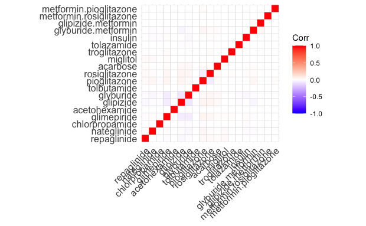

```{r include = FALSE}
library(here)
```

# 1 Executive Summary

## 1.1 Background

Reducing early (\<30 days) hospital readmissions is of paramount policy priority aimed at improving healthcare quality. Hence, numerous studies have explored this topic (including Leppin et al. (2015) <https://www.ncbi.nlm.nih.gov/pmc/articles/PMC4249925/>)

From our manipulated dataset (manipulation steps detailed below), almost ten percent (8.97%) of patients diagnosed with diabetes come back to the hospital for an inpatient visit. Considering that this number does not consider patients who 1.dies/gets relocated to hospice (hence cannot be readmitted) or 2. re-visits hospital for outpatient visit, this is only the lower bound of the problem in our healthcare system.

(State the problem well enough to convince the reader think that the question we are answering is important. Cite IMF, WorldBank, ...)

Some motivating plots here.

## 1.2 Objective

Our research question

# 2 Technical Exposition

## 2.1 Data Identification

In order to determine the usefulness, reliability, and relevance of the data, each data element was analyzed to determine if it should be included as transformations to impact re admittance. The data elements themselves are organized in 3 categories: patient history, treatment, and patient demographic.

### Patient Identification

#### encounter_id

Used as the index for hospital visits

#### patient_nbr

Used as the index for patients

#### weight / medical_specialty

Not used as the data was too sparse.

#### payer_code //check to make sure

Not used due to irrelevance.

### Treatment

#### admission_type_id / admission_source_id

The type of admission and source of admission can indicate the intensity or stage until diabetes diagnosis, impacting the effectiveness of possible future medications.

#### discharge_disposition_id

The type of discharge can indicate the condition of patient after care, impacting the possibility of future re-admittance.

#### time_in_hospital

May indicate the condition of the patient during treatment and the incidence of re admittance.

#### medical_specialty //check again

Not used as treatment is assumed to be standardized.

#### num_lab_procedures / num_procedures

How many times a patient is tested may impact the quality of the diagnosis and treatment.

#### num_medications

The number of medications may indicate the severity of diabetes.

#### diag_1

This data was grouped into 9 codes as previously stated in 2.1. Impacts the medication given.

#### diag_2 / diag_3

Are not the primary diagnoses, therefore removed to simplify the data.

#### number_diagnoses

May indicate the quality of the diagnosis and treatment offered.

#### diabetesMed

The prescription of diabetic medication may impact the incidence of diabetes.

#### change

Change in diabetic medication may indicate the changing severity of diabetes on the patient.

### Medication

#### metformin / repaglinide / nateglinide / chloropropamide / glimepiride / acetohexamide / glipizide / glyburide / tolbutamide / pioglitazone / rosiglitazone / acarbose / miglitol / troglitazone / tolazamide / examide / citoglipton / insulin / glyburide-metformin / glipizide-metformin / glimepiride-pioglitazone / metformin-rosiglitazone / metformin-ploglitazone

The type and combination of medication prescribed may impact diabetes treatment. processes.

### Patient History and Health

#### gender

Genetic differences may impact re-admittance, as well as social or systematic biases that may change how different genders are treated.

#### age

Different ages may change the outcome of diabetes, like older individuals being more prone to the impacts of diabetes as well as having other health conditions.

#### number_outpatient / number-emergency / number_inpatient

The number of preceding encounters may indicate other health conditions that may impact the severity of diabetes.

#### max_glu_serum / A1Cresult

The main two indicators of diabetes, with varying ranges indicating varying diabetes impacts.

### Target Variable

#### readmitted

Indicates the range of days until a patient was readmitted.

### Limitations
Agreeing with the justifications made by S.Towers (2014), we admit to biases derived from binning, specifically from the data elements "max_glu_serum" and "A1Cresult". Both elements indicate a range, generalizing all continuous values inside each range. Fitting data inside binned ranges may also bias models, as they underpin the assumptions of future models.

## 2.2 Data Manipulation

Agreeing with the justifications made by Strack et al.(2014), we performed the following data manipulation prior to model fitting (see Strack et al.(2014) for the justifications). We checked that our summary statistics match Table2 of Strack et al.

1.  Ignored the following features: wieght and payer code
2.  Imputed '?' in medical specialty with "missing"
3.  Kept only the first encounter for each patient.
4.  Removed all encounters that resulted in either discharge to a hospice or patient death (because for these patients, no readmission is not a positive outcome)
5.  Grouped icd9 (diag_1) codes by: circulatory, respiratory, digestive, diabetes, injury, musculoskeletal, genitourinary, neoplasms, and other. (9 categories from 848 variables)

As well, the following change was made to the target variable: 1. Focused on "recent readmittance" by categorizing the "readmitted" element as either \<30 days or "other"


## 2.3 Modeling

Assumptions (both implicit and explicit) made in the Strack et al.(2014) were made in our analysis as well. Below are these assumptions.

1.  There is no seasonality in the data. That is, we treat our data as cross-sectional.
2.  Readmissions (especially early re-admissions) are regarded as a negative outcome. Put it differently, non-readmissions are regarded as a positive outcome. That is, we ignore patients' lack of trust in the healthcare system which could prevent them visiting hospitals (e.g., Black patients' disbelief in the healthcare systemn has been documented in literatures such as <https://www.ncbi.nlm.nih.gov/pmc/articles/PMC3758504/>).

Note that just like in Strack et al. (2014), we focus on "early" re-admissions. This is because if we focus on readmitted/non-readmitted instead, we would inevitably have to make an unreasonable assumption that having 'NO' for readmitted means that the patient was never readmitted (we don't know this because our data ends at 2008).


### Medicine Similarity

In order to determine what model to use, we created a matrix to determine if some medicines were usually grouped together in use. 

First, three Medicines were removed because they were never used: examide, glimepiride.pio, and cytoglipton. The matrix revealed that there were a few, very weak correlations, the maximum of which was 4.459526e-02. This indicated that it would be difficult to group the medicines together.


```{r image-ref-for-in-text, echo = FALSE, message=FALSE, fig.align='center', fig.cap='Medicine Matrix', out.width='0.6\\linewidth'}
 
```

```{r image-ref-for-in-text2, echo = FALSE, message=FALSE, fig.align='center', fig.cap='California Population', out.width='0.6\\linewidth'}
knitr::include_graphics("../plot/sample plot2.png")
```

```{r image-ref-for-in-text32, echo = FALSE, message=FALSE, fig.align='center', fig.cap='reg table', out.width='0.6\\linewidth'}
knitr::include_graphics("../plot/test.pdf")
```

## 2.4 Encoding

In order to encode the Medication columns, two processes were tried.

### Label Encoding

It was hypothesized that patients receive similar medication combinations based on common diagnoses and test results. Each combination would be assigned a unique number. However, since there are 22 treatment columns, the max combination is 4\^22, a large number. The actual number of combinations is 1099.

### One Hot Encoding

This encoding is not idea because of dimensionality, drastically increasing the number of combinations as it assumes that each medication has no relationship with each other. However, there are much fewer combinations. Each medication can either be "up", "down", "steady", or "no", with a 1 or 0 encoded for each of these options per medication. Therefore, there were only 4\*22 = 88 combinations, much better than the number of categories made by label encoding. One Hot Encoding was chosen.


# 3 Conclusion


