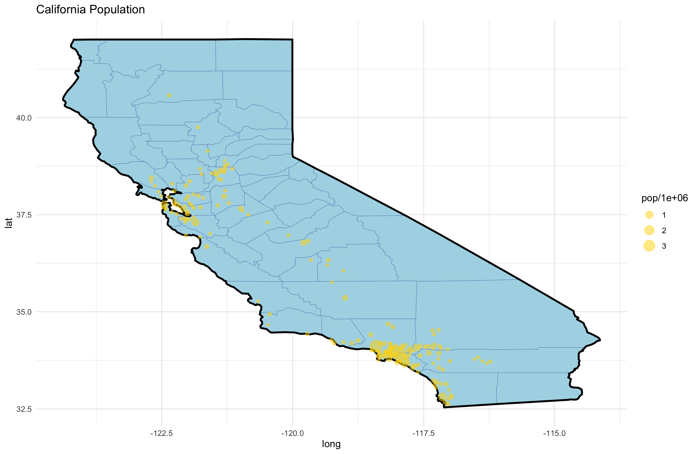

```{r include = FALSE}
library(here)
```

# 1 Executive Summary

## 1.1 Background 

Reducing early (<30 days) hospital readmissions is of paramount policy priority aimed at improving healthcare quality. Hence, numerous studies have explored this topic (including Leppin et al. (2015) https://www.ncbi.nlm.nih.gov/pmc/articles/PMC4249925/)

From our manipulated dataset (manipulation steps detailed below), almost ten percent (8.97%) of patients diagnosed with diabetes come back to the hospital for an inpatient visit. Considering that this number does not consider patients who 1.dies/gets relocated to hospice (hence cannot be readmitted) or 2. re-visits hospital for outpatient visit, this is only the lower bound of the problem in our healthcare system.


(State the problem well enough to convince the reader think that the question we are answering is important.
Cite IMF, WorldBank, ...)

Some motivating plots here.

## 1.2 Objective
Our research question

# 2 Technical Exposition

## 2.1 Data Manipulation
Agreeing with the justifications made by Strack et al.(2014), we performed the following data manipulation prior to model fitting (see Strack et al.(2014) for the justifications). We checked that our summary statistics match Table2 of Strack et al.

1. Ignored the following features: weight and payer code
2. Imputed '?' in medical specialty with "missing"
3. Kept only the first encounter for each patient.
4. Removed all encounters that resulted in either discharge to a hospice or patient death (because for these patients, no readmission is not a positive outcome)
5. Grouped icd9 codes by: circulatory, respiratory, digestive, diabetes, injury, musculoskeletal, genitourinary, neoplasms, and other.


## 2.2 Modeling

Assumptions (both implicit and explicit) made in the Strack et al.(2014) were made in our analysis as well. Below are these assumptions. 

1. There is no seasonality in the data. That is, we treat our data as cross-sectional.
2. Readmissions (especially early re-admissions) are regarded as a negative outcome. Put it differently, non-readmissions are regarded as a positive outcome. That is, we ignore patients' lack of trust in the healthcare system which could prevent them visiting hospitals (e.g., Black patients' disbelief in the healthcare systemn has been documented in literatures such as https://www.ncbi.nlm.nih.gov/pmc/articles/PMC3758504/).

Note that just like in Strack et al. (2014), we focus on "early" re-admissions. This is because if we focus on readmitted/non-readmitted instead, we would inevitably have to make an unreasonable assumption that having 'NO' for readmitted means that the patient was never readmitted (we don't know this because our data ends at 2008).

```{r image-ref-for-in-text, echo = FALSE, message=FALSE, fig.align='center', fig.cap='US Population', out.width='0.6\\linewidth'}
knitr::include_graphics("../plot/sample plot.png")
```

```{r image-ref-for-in-text2, echo = FALSE, message=FALSE, fig.align='center', fig.cap='California Population', out.width='0.6\\linewidth'}

```

```{r image-ref-for-in-text32, echo = FALSE, message=FALSE, fig.align='center', fig.cap='reg table', out.width='0.6\\linewidth'}
knitr::include_graphics("../plot/test.pdf")
```

# 3 Conclusion

