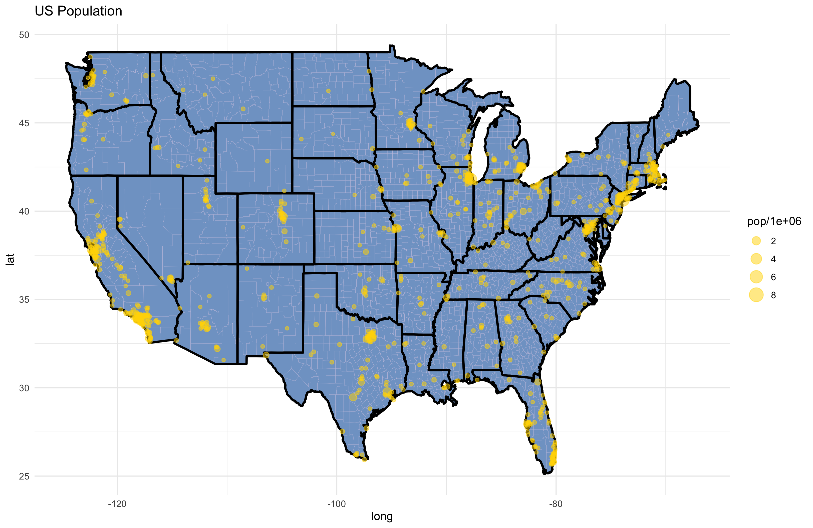
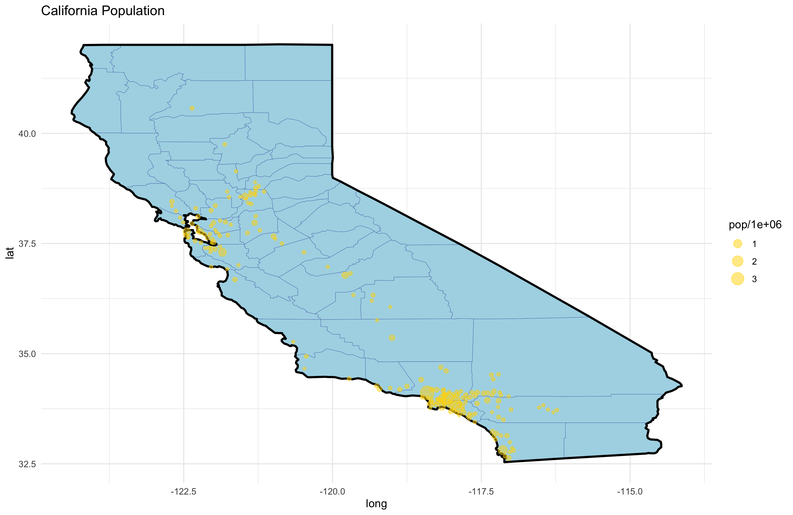

```{r include = FALSE}
library(here)

```

# 1 Executive Summary

## 1.1 Background 
State the problem well enough to convince the reader think that the question we are answering is important.
Cite IMF, WorldBank, ...

## 1.2 Objective
Our research question

# 2 Data

## 2.1 Data A

## 2.2 Data B

## 2.3 Data C

# 3 Results
## 3.1 (EDA)

```{r image-ref-for-in-text, echo = FALSE, message=FALSE, fig.align='center', fig.cap='US Population', out.width='0.6\\linewidth'}

```

```{r image-ref-for-in-text2, echo = FALSE, message=FALSE, fig.align='center', fig.cap='California Population', out.width='0.6\\linewidth'}

```

```{r image-ref-for-in-text32, echo = FALSE, message=FALSE, fig.align='center', fig.cap='reg table', out.width='0.6\\linewidth'}
knitr::include_graphics("../plot/test.pdf")
```

## 3.2 (Model)

# 4 Conclusion

